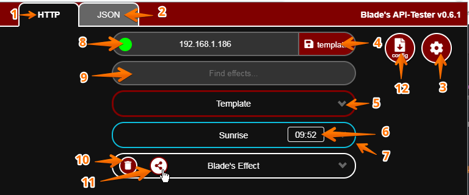

## Deprecated soon... https://github.com/YeonV/Blade-WLED-Extension-React

# Blade-WLED-Extension v0.6.2

| \#  | Function                      |
| --- | ----------------------------- |
| 1   | HTTP-API-Tester               |
| 2   | JSON-API-Tester               |
| 3   | Toggle Settings               |
| 4   | Save Template                 |
| 5   | Modify Template               |
| 6   | Current effect countdown      |
| 7   | Current effect active state   |
| 8   | WLED Online/Offline state     |
| 9   | Live Search Effects           |
| 10  | Delete this effect            |
| 11  | Share this effect on WLED-CMS |
| 12  | Save current config.js\*      |

\* until storage is handled via extension, the config.js needs to be replaced

### Why v0.6.1?

| Description                         | Version |
| ----------------------------------- | ------- |
| Implemented Blade's WLED-API-Tester | v.0.5   |
| Added a lot of functionality        | v.0.5.5 |
| Make it a Chrome-Extension          | v0.6.0  |
| Implemented CMS-Synergies           | v0.6.1  |
